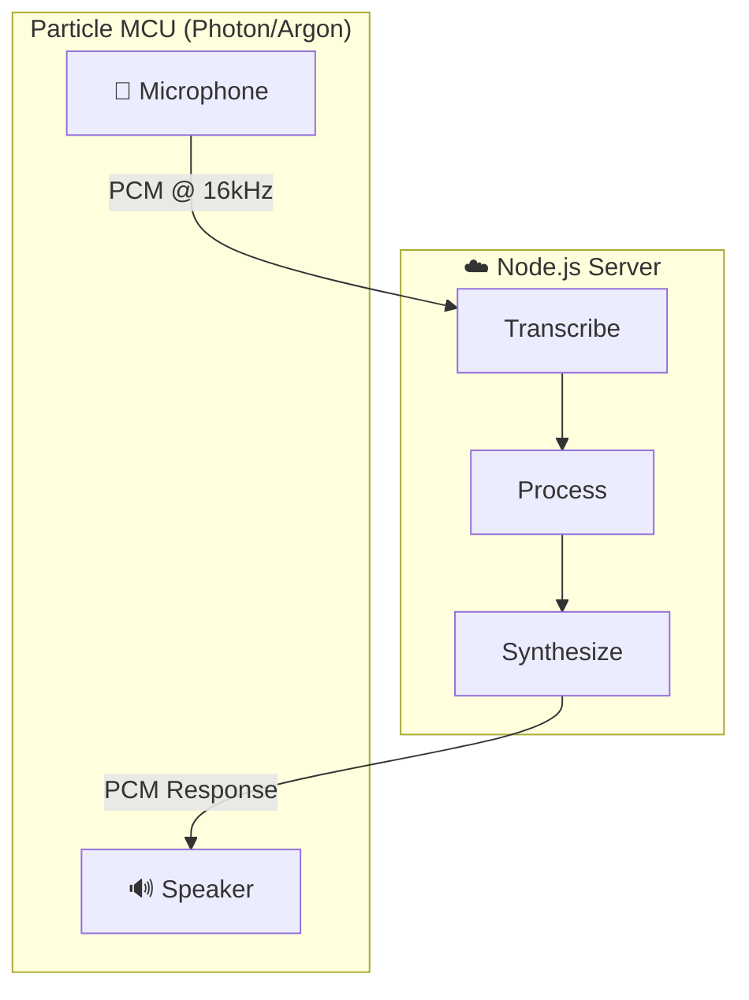

# Microstream

[](https://www.npmjs.com/package/microstream-server)
[](https://build.particle.io/libs/microstream)
[](LICENSE)

Bidirectional audio streaming between Particle microcontrollers and Node.js servers. Build voice assistants, intercoms, and audio IoT devices with real-time push-to-talk communication.

## Overview

Microstream provides two components that work together:

| Component | Package | Installation |
|-----------|---------|--------------|
| **Server** | [microstream-server](https://www.npmjs.com/package/microstream-server) | `npm install microstream-server` |
| **Firmware** | [microstream](https://build.particle.io/libs/microstream) | `particle library add microstream` |



## Quick Start

### 1. Server Setup

```bash
npm install microstream-server
```

```javascript
const { MicrostreamServer } = require('microstream-server')

const server = new MicrostreamServer({ port: 5000 })

server.on('session', (session) => {
  console.log(`Device connected: ${session.id}`)

  session.on('audioEnd', (wavBuffer) => {
    // Process audio (speech-to-text, AI response, etc.)
    // Then send audio back to device:
    session.play(responseAudioBuffer)
  })
})

server.listen(() => console.log('Listening on port 5000'))
```

### 2. Firmware Setup

```
particle library add microstream
```

```cpp
#include "Microstream.h"

#define MIC_PIN      A0
#define SPEAKER_PIN  A3
#define BUTTON_PIN   D3

Microstream stream;
bool buttonDown = false;

void setup() {
  pinMode(BUTTON_PIN, INPUT_PULLUP);

  MicrostreamConfig cfg;
  cfg.sampleRate = 16000;
  cfg.bitDepth = 16;
  cfg.micPin = MIC_PIN;
  cfg.speakerPin = SPEAKER_PIN;

  stream.begin("YOUR_SERVER_IP", 5000, "/", cfg);
}

void loop() {
  stream.update();

  bool pressed = (digitalRead(BUTTON_PIN) == LOW);

  if (pressed && !buttonDown && stream.isConnected()) {
    buttonDown = true;
    stream.startRecording();
  }

  if (!pressed && buttonDown) {
    buttonDown = false;
    stream.stopRecording();
  }
}
```

### 3. Hardware

| Component | Connection | Notes |
|-----------|------------|-------|
| Electret mic + MAX4466 amp | A0 | Any analog pin |
| Speaker + amp | A3 (Photon) or A6 (Argon) | DAC output |
| Push button | D3 | Optional, active low |

## Documentation

- **[Server API Reference](server/README.md)** - Full Node.js API, events, protocol details
- **[Firmware API Reference](firmware/README.md)** - Particle library API, hardware wiring, callbacks

## Examples

| Example | Description |
|---------|-------------|
| [Basic Firmware](firmware/examples/basic/basic.ino) | Minimal push-to-talk |
| [Chatbot Firmware](firmware/examples/chatbot/chatbot.ino) | Voice assistant with LED feedback |
| [Voice Assistant Server](examples/server/app.js) | OpenAI Whisper + GPT + TTS integration |
| [Echo Server](examples/server/roundtrip-test.js) | Loopback testing |

## Features

**Server**
- TCP and WebSocket on same port (auto-detected)
- Automatic PCM → WAV conversion
- Multiple concurrent device sessions
- Event-driven API

**Firmware**
- Interrupt-driven audio capture
- Ring-buffered playback
- Automatic reconnection with backoff
- Playback level callbacks for visualizations

## License

MIT License - see [LICENSE](LICENSE)
